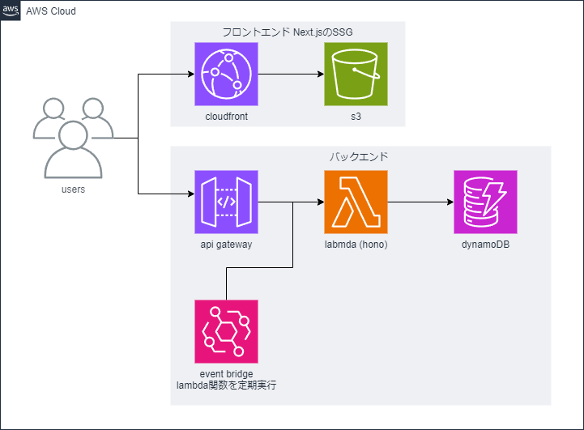

# TechStock

技術記事管理システム

## アーキテクチャ



## プロジェクト構成

- **フロントエンド**: Next.js (SSG) - CloudFront + S3 にデプロイ
- **バックエンド**: Hono + AWS Lambda + API Gateway + DynamoDB
- **インフラストラクチャ**: AWS CDK

## ディレクトリ構造

```
TechStock/
├── frontend/        # Next.jsプロジェクト
├── backend/         # Honoアプリケーション
└── infrastructure/  # AWS CDKコード
```

## 開発方法

### 前提条件

- Node.js 18 以上
- Docker と Docker Compose
- AWS CLI のセットアップとプロファイル設定
- AWS CDK のインストール

### セットアップ手順

1. リポジトリのクローン:

   ```bash
   git clone https://github.com/yourusername/TechStock.git
   cd TechStock
   ```

2. フロントエンド開発:

   ```bash
   cd frontend
   npm install
   npm run dev
   ```

3. バックエンド開発:

   ```bash
   cd backend
   npm install
   npm run dev
   ```

4. インフラストラクチャのデプロイ:
   ```bash
   cd infrastructure
   npm install
   npm run cdk bootstrap
   npm run cdk deploy
   ```

### ローカル開発環境

ローカルで DynamoDB を使用して開発する場合は、Docker Compose を使ってローカル環境を起動できます：

```bash
docker-compose up -d
```

これにより以下のサービスが起動します：

- **LocalStack**: `http://localhost:4566` - AWSサービスのローカルエミュレーター

#### Windows環境での注意点

Windows環境でLocalStackコンテナに接続する場合は、以下のコマンドを使用してください：

```bash
# bashではなくshを使用
docker compose exec localstack sh
```

Windowsの場合、`/bin/bash`パスがコンテナ内で正しく解決されない問題があります。`sh`を使うことでこの問題を回避できます。

## バッチ処理

AWS EventBridgeを使用して、以下のバッチ処理が定期実行されます：

- **Qiita記事取得処理**
  - 実行時間: 毎日午前0時（JST）
  - 処理内容: 指定されたQiitaユーザーの記事を取得しDynamoDBに保存
  - 実行方法: EventBridgeのcronスケジュールにより自動実行
  - 設定場所: `infrastructure/lib/backend-stack.ts`のEventBridgeルールで定義
